# IncidentOps


IncidentOps is a production-ready full-stack incident management platform built with Spring Boot and React. It provides secure authentication, complete incident lifecycle management, collaboration through comments and timelines, and AI-powered incident analysis using Retrieval-Augmented Generation (RAG). The application is fully containerized and deployed on AWS, demonstrating a production-oriented architecture.
---

# Tech Stack

## Backend

- Java 21
- Spring Boot
- Spring Security
- JWT Authentication
- Spring Data JPA
- Spring AI
- Flyway
- Docker

## Frontend

- React
- Vite
- React Router
- Axios
- Tailwind CSS
- Context API
  
## Database

- PostgreSQL
- Redis
- PgVector

## AI

- Spring AI
- Gemini
- RAG
---
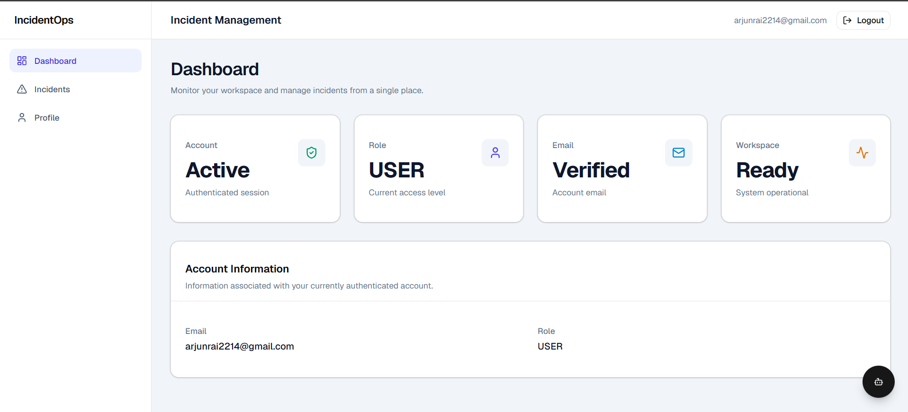
## Highlights

- JWT Authentication with OTP-based email verification
- Role-Based Access Control (RBAC)
- Incident lifecycle management
- AI-powered incident summaries & root cause analysis
- Semantic search using RAG
- Dockerized deployment using Docker Compose
- Production deployment on AWS EC2
- AI-powered incident analysis using RAG


# Features Implemented

## Authentication

### User Registration

A new user registers using their email and password.

Flow:

1. User enters registration details.
2. Backend validates the request.
3. User information is stored temporarily.
4. An OTP is generated.
5. OTP is stored in Redis with an expiry.
6. OTP is emailed to the user.
7. Frontend redirects to the verification page.
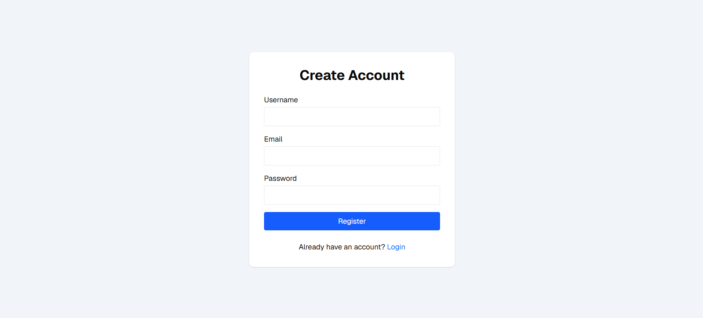

---

### Email Verification

Flow:

1. User enters the OTP.
2. Backend validates the OTP against Redis.
3. If valid:
   - User is created in PostgreSQL.
   - Redis entry is removed.
4. User is redirected to Login.
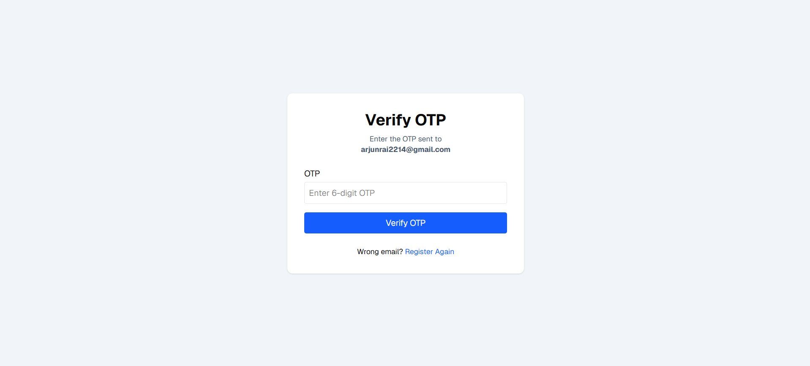

---

### Login

Flow:

1. User enters email and password.
2. Credentials are authenticated.
3. JWT token is generated.
4. Token is returned to the frontend.
5. Frontend stores the token.
6. Every subsequent API request automatically includes the JWT.
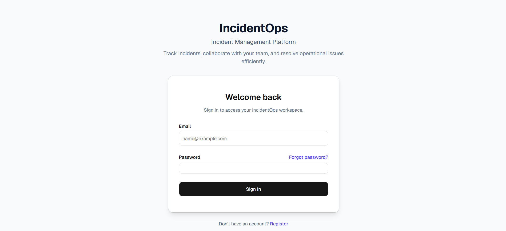

---

### Protected Routes

Authenticated users can access:

- Dashboard
- Incidents
- Profile

Unauthenticated users are redirected to Login.

---

### Forgot Password

Flow:

1. User enters registered email.
2. Backend generates a password reset OTP.
3. OTP is stored in Redis.
4. OTP is emailed.
5. Frontend redirects to Reset Password.

---

### Reset Password

Flow:

1. User enters:
   - OTP
   - New Password
2. Backend validates OTP.
3. Password is updated.
4. Redis entry is deleted.
5. User is redirected to Login.

---

# Incident Management

## Incident List

Implemented:

- List incidents
- Server-side pagination
- Server-side searching
- Status filtering
- Priority filtering
- Sorting
- Loading state
- Empty state
- Error handling

All filtering and sorting are performed by the backend.

---

## Create Incident

Users can create a new incident.

Captured information:

- Title
- Description
- Priority
- Assignee (if provided)

Status is automatically initialized as **OPEN** by the backend.
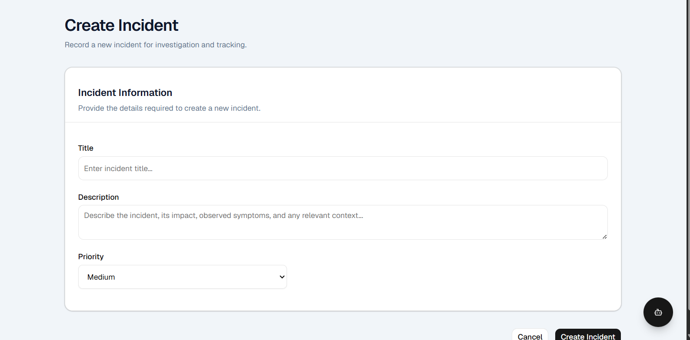

---

## View Incident

Displays complete incident information including:

- Title
- Description
- Status
- Priority
- Creator
- Assignee
- Created timestamp
- Updated timestamp
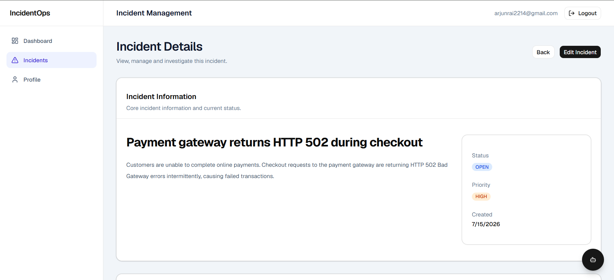

---

## Update Incident

Users can update incident details.

Editable fields:

- Title
- Description
- Priority
- Status
- Assignee

Save operation is available only when editing.

---

## Comments

Implemented:

- View comments
- Add new comments

Comments are displayed chronologically with:

- Author
- Timestamp
- Comment text

Comments cannot be edited.

---

## Timeline

Displays incident history.

Each event contains:

- Event type
- Description
- Timestamp

Timeline is read-only.
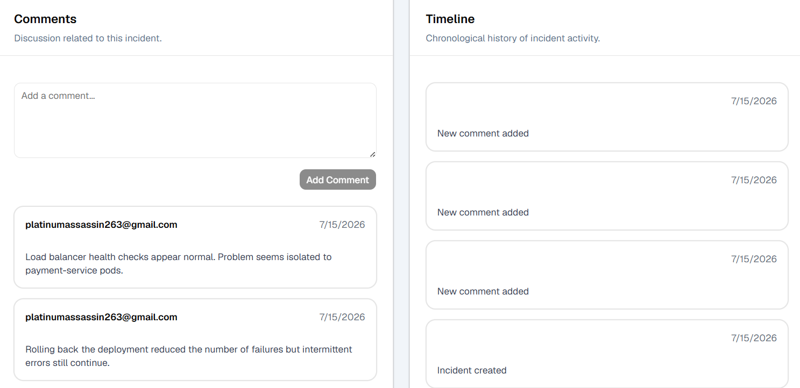

---

# Profile

Implemented:

Displays authenticated user's:

- User ID
- Email
- Role

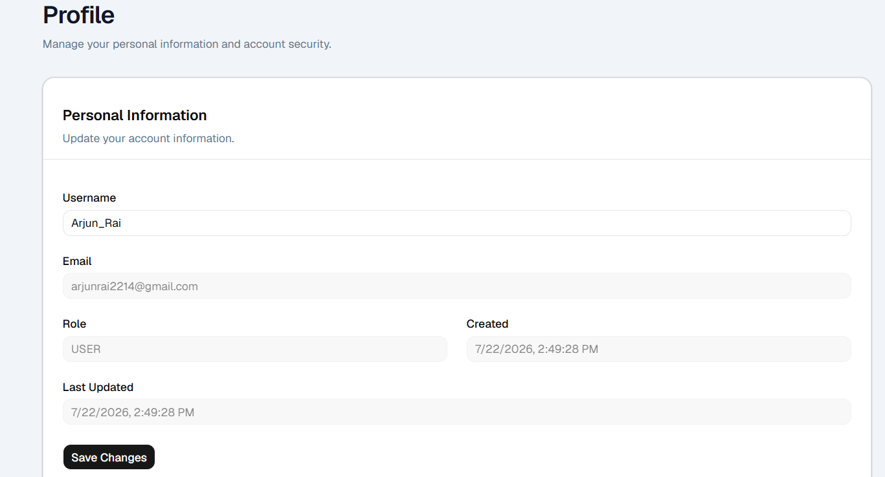

Information is retrieved from:

```
GET /api/v1/auth/me
```
# Update Profile:
Implemented
- User is able to update email address, the OTP is sent to the new email for verification.
- User is able to update password following OTP verification done through registered email.
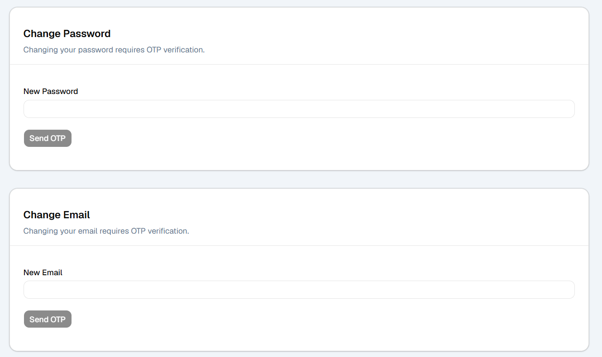


---

# Frontend Architecture

## API Layer

Dedicated API modules:

- authApi
- incidentApi
- commentApi
- timelineApi
- profileApi
- aiApi

---

## Authentication

Implemented using React Context.

Responsibilities:

- Login
- Logout
- Authentication state
- Current user
- Route protection

---

## Routing

Public Routes

- Login
- Register
- Verify OTP
- Forgot Password
- Reset Password

Protected Routes

- Dashboard
- Incidents
- Profile

---

## Reusable Components

Implemented reusable components:

- Button
- Card
- Loader
- EmptyState
- Retrieval Pipeline

---

# Backend Infrastructure

Implemented

- PostgreSQL persistence
- PgVector
- Flyway migrations
- Redis
- JWT authentication
- Spring Security
- Spring AI
- Ollama
- Docker Compose

Redis is currently used for:

- Registration OTP
- Password Reset OTP

---

# Deployment

IncidentOps is deployed using a containerized architecture on AWS.

## Infrastructure

- Backend deployed on AWS EC2
- PostgreSQL running inside Docker
- Redis running inside Docker
- Ollama running locally on the EC2 instance for AI inference

## Deployment Workflow

1. Code is pushed to GitHub.
2. Docker images are built on the EC2 instance.
3. Docker Compose starts all required services.
4. AI requests are handled through the local Ollama service.

---
# Current Application Flow

```
Register
      │
      ▼
Email OTP Verification
      │
      ▼
Login
      │
      ▼
JWT Authentication
      │
      ▼
Dashboard
      │
      ├──────────────► Profile
      │                    │
      │                    ├── Change Email
      │                    └── Change Password
      │
      └──────────────► Incidents
                             │
                             ├── Create
                             ├── Search
                             ├── Filter
                             ├── Update
                             ├── Comments
                             ├── Timeline
                             ├── AI Summary
                             ├── Similar Incidents
                             └── AI Chat
```

---

# AI Module

IncidentOps now includes a Retrieval-Augmented Generation (RAG) pipeline built using Spring AI, Ollama and PgVector.

## AI Chat

Capabilities:

- Natural language chat interface
- Retrieval-Augmented Generation (RAG)
- Semantic search over indexed incidents
- Context-aware responses using retrieved incidents
- Hallucination guardrail for unknown queries

Flow:

1. User submits a question.
2. Relevant incident documents are retrieved from PgVector using vector similarity search.
3. Retrieved documents are used to build a grounded prompt.
4. Prompt is sent to the LLM.
5. AI generates a response using only the retrieved context.
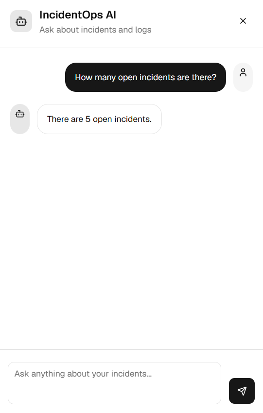

---

## Automatic Incident Indexing

Every newly created incident is automatically indexed.

Flow:

1. Incident is converted into a structured AI document.
2. Metadata is attached to the document.
3. Document is split into chunks.
4. Embeddings are generated using Ollama.
5. Chunks and embeddings are stored in PgVector.

This keeps the vector database synchronized with the incident database.

---

## Similar Incident Retrieval

Implemented:

- Semantic similarity search
- Vector search using PgVector
- Retrieval of related historical incidents

Instead of matching keywords, similar incidents are retrieved based on semantic meaning.
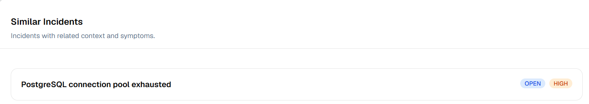

---

## AI Incident Summary

Implemented:

- AI-generated incident summaries
- Context-aware summarization using similar incidents
- Grounded responses using retrieved documents only

The generated summary includes:

- What happened
- Affected component
- Probable impact

The model does not invent information outside the retrieved context.
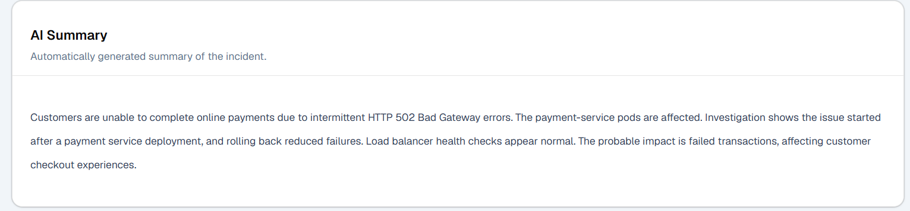

---

## AI Root Cause Analysis & Resolution Suggestions

Implemented:

- AI-generated root cause analysis
- Context-aware analysis using similar historical incidents
- Actionable resolution suggestions based on retrieved incidents
- Grounded responses using retrieved documents only

The generated analysis includes:

-  Probable root cause
-  Supporting evidence from similar incidents
-  Recommended resolution steps
-  Preventive recommendations (when applicable)

The model does not invent causes or recommendations outside the retrieved context.

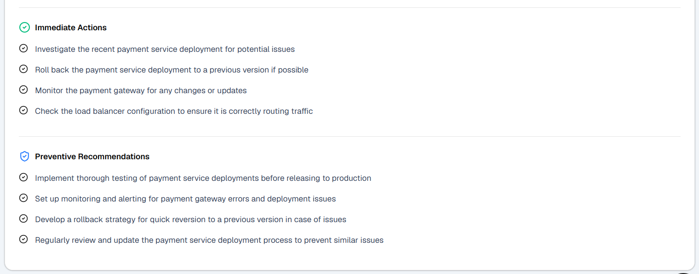


# Project Status

| Module                      | Status |
|-----------------------------|--------|
| Authentication              | ✅ Complete |
| Registration OTP            | ✅ Complete |
| Password Reset              | ✅ Complete |
| JWT Authentication          | ✅ Complete |
| Profile                     | ✅ Complete |
| Incident CRUD               | ✅ Complete |
| Comments                    | ✅ Complete |
| Timeline                    | ✅ Complete |
| Search                      | ✅ Complete |
| Filters                     | ✅ Complete |
| Sorting                     | ✅ Complete |
| Pagination                  | ✅ Complete |
| AI Chat (RAG)               | ✅ Complete |
| Automatic Incident Indexing | ✅ Complete |
| Semantic Search             | ✅ Complete |
| Similar Incident Retrieval  | ✅ Complete |
| AI Incident Summary         | ✅ Complete |
| Root Cause Analysis         | ✅ Complete |
| Resolution Suggestions      | ✅ Complete |
| Final UI Polish             | ✅ Complete |
| Dockerization               | ✅ Complete |
| Deployment (AWS EC2)        | ✅ Complete |
